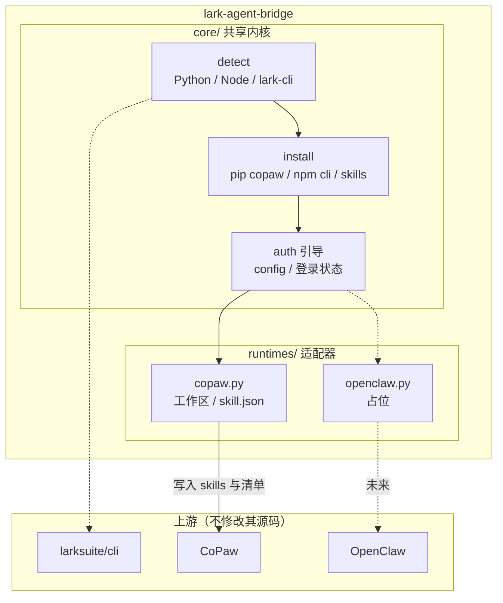
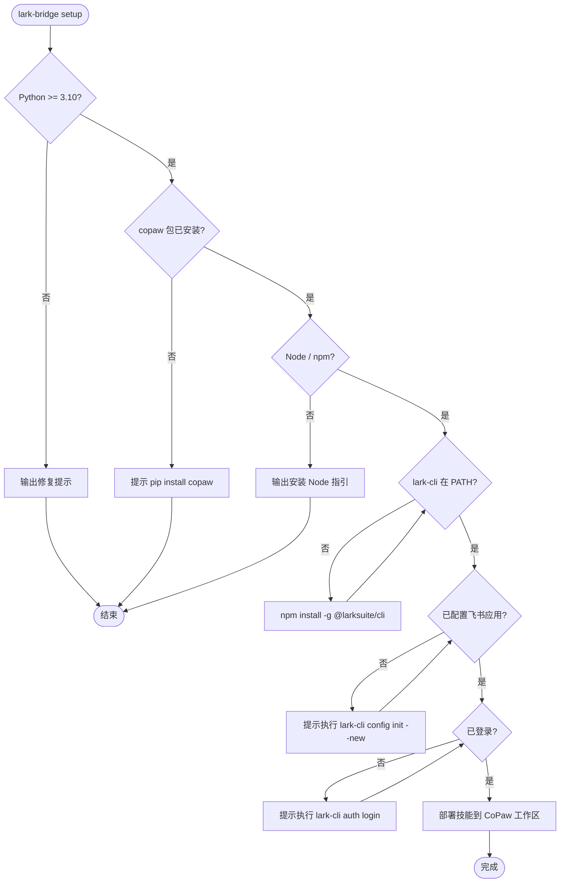

# 开发者 / 贡献者文档

> 如果你只是**使用** lark-agent-bridge，请看 [README.md](README.md)。  
> 本文面向想**贡献代码或理解内部实现**的开发者。

---

## 1. 设计原则

| 原则 | 说明 |
|------|------|
| 上游零侵入 | 仅通过命令行、用户目录下的配置与技能文件集成 |
| 运行时插件化 | **共享内核**（检测 lark-cli、安装 npm 包、OAuth 引导）；**按 runtime 分支**（工作区路径、`skill.json` 格式、Skill 模板路径） |
| 可重复执行 | 幂等：已满足则跳过或明确提示 |
| 可诊断 | 每步成功/失败与修复建议 |
| 安全默认 | Skill 内对 `lark-cli` 子命令白名单；密钥不落本仓库 |
| 跨平台 | 路径、进程、编码在 Win/Linux/macOS 显式处理 |

---

## 2. 运行时支持矩阵

| 运行时 | 状态 | 说明 |
|--------|------|------|
| **CoPaw** | **已实现** | 默认工作区 `~/.copaw/workspaces/...`，`COPAW_WORKING_DIR` 可覆盖 |
| **OpenClaw** | **占位** | 待上游 API/目录约定明确后实现；`runtimes/openclaw.py` 仅 `NotImplementedError` |

---

## 3. 架构

### 3.1 分层架构



### 3.2 `lark-bridge setup` 主流程



### 3.3 纯文本版

```text
[用户] → lark-bridge CLI
            │
            ├─ core: detect → install → auth 引导
            │        └─ 调用本机: pip / npm / lark-cli（不修改上游）
            │
            └─ runtime 分支
                   ├─ copaw  → ~/.copaw/workspaces/… + skill.json + Skill
                   └─ openclaw → （占位）

lark-cli ←── 共享内核安装与检测 ──→ 飞书开放平台 API
CoPaw   ←── 仅通过工作区文件集成 ──→ 与内置飞书通道并行
```

---

## 4. 功能清单

### 已实现

| 功能 | 入口 | 模块 |
|------|------|------|
| 环境探测（Python/Node/npm/lark-cli/config/auth） | `setup`, `status`, `doctor` | `core/detect.py` |
| npm 全局安装 lark-cli（支持国内镜像 `--cn`） | `setup` | `core/install.py` |
| CoPaw 工作区技能部署/覆盖 | `setup`, `update`, `fix` | `runtimes/copaw.py` |
| `skill.json` 安全合并（只改本条目、保留其它技能） | 部署时自动 | `manifest/merge.py` |
| lark-cli 冒烟自检 | `verify` | `self_check.py` |
| 技能与 lark-cli 卸载 | `uninstall` | `cli.py` + `copaw.py` |
| lark-cli 透传（`lark-bridge cli ...`） | `cli`, `lark` | `cli_forward.py` |

### 规划中

| 功能 | 说明 |
|------|------|
| OpenClaw 适配 | 待上游 API 稳定 |
| `--verbose` / `--log-file` | 低优先级 |
| 网络可达性检测 | `doctor` 中 |

---

## 5. Skill 设计

### 5.1 CoPaw Skill 运行机制

CoPaw 启动时把 `SKILL.md` 的内容**注入到 AI 的系统提示词**里。AI 在对话中看到这些说明后，**自己决定**何时调用已有的工具（如 `execute_shell_command`）来执行操作。`references/` 目录是辅助资料，供 AI 通过 `read_file` 工具读取。

### 5.2 Skill Scanner 安全扫描

CoPaw 在创建、导入、启用 Skill 时会自动扫描内容（`PatternAnalyzer`）：

- 会被拦截的模式（CRITICAL/HIGH）：`os.system(`、`subprocess.*shell=True`、`eval(`、`exec(`、`curl|bash` 等
- 文件限制：单个 Skill 最多约 100 个文件，单文件 5 MB
- 命中高危规则 → `is_safe == False` → Skill 无法启用

**设计决策**：Skill 不在 `scripts/` 中写 Python 子进程调用代码。`SKILL.md` 只用自然语言指导 AI 使用 `execute_shell_command` 去调 `lark-cli`。

### 5.3 Tool Guard 约束

CoPaw 的 Tool Guard 会实时检查 `execute_shell_command` 的命令字符串：

- `lark-cli` 本身不在危险列表中，正常调用不会被拦
- 若命令拼接了危险模式（如 `&& rm -rf /`），仍会被拦截
- SKILL.md 指导 AI 只使用白名单内的 `lark-cli` 子命令，不拼接任意用户输入

### 5.4 `skill.json` 清单条目

```json
{
  "schema_version": "workspace-skill-manifest.v1",
  "version": 1744000000000,
  "skills": {
    "lark_cli_bridge": {
      "enabled": true,
      "channels": ["all"],
      "source": "customized",
      "metadata": {
        "name": "lark_cli_bridge",
        "description": "通过本机 lark-cli 操作飞书",
        "version_text": "0.2.2"
      },
      "requirements": {
        "require_bins": ["lark-cli"],
        "require_envs": []
      },
      "updated_at": "2026-04-07T00:00:00Z"
    }
  }
}
```

关键约束：
- `metadata.name` 必须与目录名一致
- `channels` 设为 `["all"]` 使所有通道可用
- 合并策略：只追加/更新 `lark_cli_bridge` 条目，不覆盖其它技能

---

## 6. CoPaw 衔接细节

- 数据根：`COPAW_WORKING_DIR` 默认 `~/.copaw`
- 默认工作区：`<根>/workspaces/default`
- 技能以工作区为单位解析；`skill.json` 字段需与当前 CoPaw 版本对齐
- 已验证版本：CoPaw `1.0.2b1`、AgentScope `1.0.18`
- 注入后生效：CoPaw 在每次对话/agent 启动时重新解析 `skill.json`；通常无需重启
- 多 agent 工作区：`--workspace <name>` 或 `--all-workspaces`

---

## 7. lark-cli 状态检测

### 7.1 配置检测

- 命令：`lark-cli config show`
- 已配置：stdout 输出 JSON（含 `appId`）
- 未配置：stderr `Not configured yet`，stdout 可能无 JSON，退出码仍为 0
- 检测策略：尝试解析 stdout JSON；失败则判定为未配置

### 7.2 登录检测

- 命令：`lark-cli auth status`（输出 JSON）
- 字段：`tokenStatus`（`valid` / `expired` / `not_found`）、`identity`、`expiresAt`
- 可选：`lark-cli auth status --verify` 联网校验
- 权限检查：`lark-cli auth check --scope "calendar:read"`

### 7.3 结构化退出码

| 退出码 | 含义 | 应对 |
|--------|------|------|
| 0 | 成功 | 继续 |
| 1 | API / 通用错误 | 解析 stderr JSON |
| 2 | 参数校验失败 | 提示命令格式 |
| 3 | 认证失败 | 引导 `auth login` |
| 4 | 网络错误 | 检查网络/代理 |
| 5 | 内部错误 | 建议升级 lark-cli |

### 7.4 凭证存储（平台差异）

| 平台 | 存储方式 |
|------|----------|
| Windows | DPAPI + 注册表 |
| Linux | AES-256-GCM 加密文件（`~/.lark-cli/`） |
| macOS | 系统 Keychain |

---

## 8. 跨平台适配

- 单一代码路径：Python 标准库 + `subprocess`（`shell=False`）、`pathlib`、`shutil.which`
- 编码：UTF-8；Windows 可选 cp936 兜底
- 入口：`lark-bridge`（`pyproject.toml` scripts）或 `python -m lark_agent_bridge`

路径对照：

| 项目 | Windows | Linux / macOS |
|------|---------|---------------|
| CoPaw 根（默认） | `%USERPROFILE%\.copaw` | `$HOME/.copaw` |
| lark-cli 配置 | `%USERPROFILE%\.lark-cli` | `$HOME/.lark-cli` |
| npm 全局 | `%APPDATA%\npm` | 依赖 nvm/fnm 或 `/usr/local` |

### 8.1 网络与代理（中国用户）

- npm：`setup --cn` 会在安装命令中使用 `--registry https://registry.npmmirror.com`（不修改全局 npm 配置）
- pip：用户可自行 `pip config set global.index-url https://mirrors.aliyun.com/pypi/simple/`
- lark-cli OAuth：需访问 `open.feishu.cn` / `open.larksuite.com`

---

## 9. 目录结构

```text
lark-agent-bridge/
  README.md                    # 用户文档
  DEVELOPMENT.md               # 本文件（开发者文档）
  pyproject.toml
  LICENSE
  src/lark_agent_bridge/
    __init__.py                # 版本号、SKILL_DIR_NAME
    __main__.py                # python -m lark_agent_bridge
    cli.py                     # click 子命令入口
    cli_forward.py             # lark-bridge cli/lark 透传
    self_check.py              # lark-bridge verify 冒烟
    core/
      detect.py                # 环境探测
      install.py               # pip/npm 安装
    runtimes/
      copaw.py                 # CoPaw 工作区部署
      openclaw.py              # 占位
    manifest/
      merge.py                 # skill.json 安全合并
    skills/
      lark_cli_bridge/
        SKILL.md               # CoPaw 技能主文档
        references/            # auth、输出格式、领域索引等
  tests/
    test_cli_forward.py
    test_manifest_merge.py
    test_paths.py
    test_deploy_pipeline.py
    test_detect.py             # 检测函数单测
    integration/
      test_lark_cli_optional.py
```

---

## 10. 升级与维护

| 场景 | 影响 | 应对 |
|------|------|------|
| CoPaw 大版本升级 | `skill.json` schema 可能变化 | 检测 `schema_version`，更新合并逻辑 |
| lark-cli 升级 | 子命令/输出格式可能变化 | SKILL.md 白名单重新验证；CI 冒烟 |
| 本工具升级 | 用户需同步技能文件 | `pip install -U ...` 后 `lark-bridge update` |

版本策略：`pyproject.toml` 中声明 tested 版本；每次上游发版后在 CI 中验证。

错误码规范见 [docs/error-codes.md](docs/error-codes.md)。
备份目录默认保留最近 10 份，可通过 `update/upgrade/uninstall --backup-keep` 或 `backups cleanup --keep` 调整。

---

## 11. CI

当前 GitHub Actions（`.github/workflows/ci.yml`）：
- 矩阵：Ubuntu + Windows，Python 3.11 + 3.12
- 测试：`pip install -e ".[dev]"` → `pytest tests/ -q`
- 集成测试在无 `lark-cli` 时自动 skip

Nightly 工作流（`.github/workflows/nightly-e2e.yml`）：
- Ubuntu + Python 3.12 + Node 20
- 安装全局 `@larksuite/cli`
- 执行 `tests/integration/test_lark_cli_optional.py` smoke

发布前门禁与回归清单见 [docs/release-gate.md](docs/release-gate.md)。
V1 两周 backlog 见 [docs/v1-delivery-backlog.md](docs/v1-delivery-backlog.md)。

### PyPI 与 GitHub Release

1. 在 `pyproject.toml` 与 `src/lark_agent_bridge/__init__.py` 中 bump 版本号，更新 [CHANGELOG.md](CHANGELOG.md)。
2. 提交并推送 `main`。
3. 打标签并推送（触发 [`.github/workflows/publish-pypi.yml`](.github/workflows/publish-pypi.yml) 构建并上传 PyPI）：
   ```bash
   git tag -a v0.3.7 -m "v0.3.7"
   git push origin v0.3.7
   ```
4. 在 GitHub 上 **Releases → Draft a new release**，选择该标签，填写说明后发布（用户可下载 Source zip / 用 README 中的 zip 安装命令）。
5. **首次上传 PyPI**：在仓库 **Settings → Secrets → Actions** 中配置 `PYPI_API_TOKEN`（[PyPI API token](https://pypi.org/manage/account/token/)）。推送标签后工作流会自动上传；若未配置 secret，工作流会失败，可在配置后 **Re-run failed jobs**。
6. **本地手动上传**（可选）：
   ```bash
   pip install build twine
   python -m build
   python -m twine upload dist/*
   ```
   使用用户名 `__token__`，密码为 API token。

---

## 12. 风险与边界

- **OAuth 无法完全无人化**：`config init` / `auth login` 需用户在浏览器完成授权
- **Skill Scanner 误报**：若 SKILL.md 示例被正则误判为危险模式，需调整措辞
- **两套飞书应用**：通道机器人（bot 身份）vs lark-cli（用户身份）权限不同，不是替代关系
- **并发安全**：多 agent 同时调 lark-cli 可能触发飞书 API 频控

---

## 13. 许可证

MIT（见 [LICENSE](LICENSE)）。引用上游文档需注明来源。

---

## 上游链接

- [larksuite/cli](https://github.com/larksuite/cli)
- [CoPaw](https://github.com/agentscope-ai/CoPaw)
