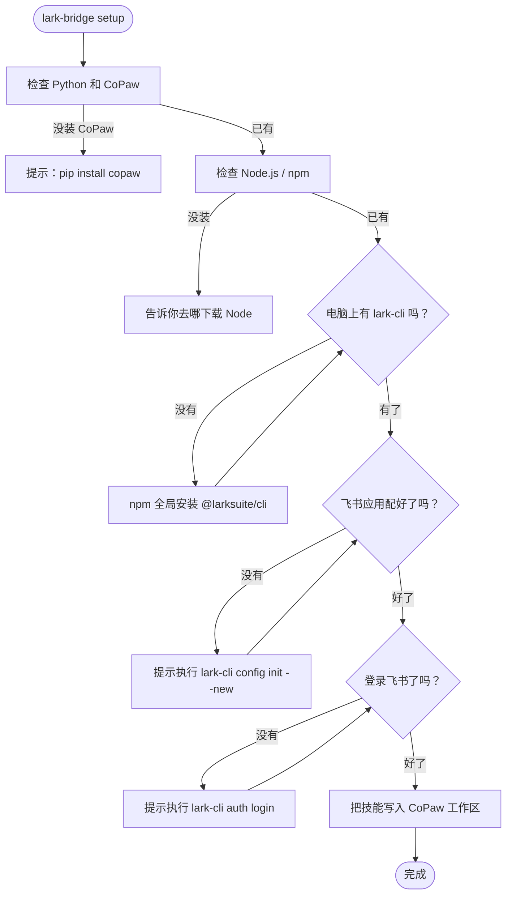
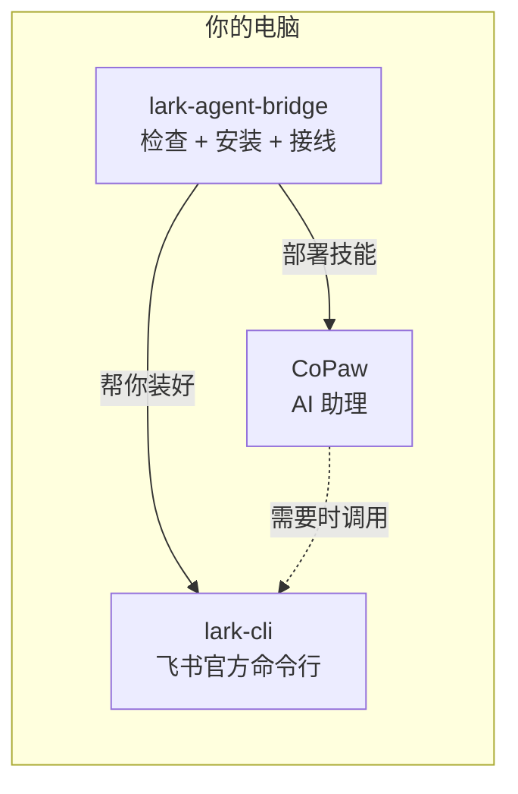

# Lark Agent Bridge

[](https://pypi.org/project/lark-agent-bridge/)
[](https://github.com/guodaxia103/lark-agent-bridge/actions)

让你的 **CoPaw** 学会用**飞书命令行**帮你办事 —— 不改任何开源项目代码。

**Windows · Linux · macOS** 通用 | 当前支持 **CoPaw**

---

## 开始前先看一眼

| 检查项 | 怎么确认 | 没有怎么办 |
|--------|----------|------------|
| **Python 3.10+** | `python --version` | 去 [python.org](https://www.python.org/downloads/) 下载 |
| **pip** | `pip --version` | Python 自带；若报错见下方 FAQ |
| **CoPaw 已初始化** | `copaw app` 能打开 | `pip install copaw` 然后 `copaw init` |
| **Node.js 18+** | `node --version` | Windows: `winget install OpenJS.NodeJS.LTS`；macOS: `brew install node`；Linux: `sudo apt install nodejs npm` |

全部打勾就可以开始了。缺哪个先装哪个，`setup` 也会帮你检查。

---

## 快速开始

### 第 1 步：安装本工具

**推荐（无需 Git）** — 从 [PyPI](https://pypi.org/project/lark-agent-bridge/) 安装已发布的 wheel：

```bash
pip install lark-agent-bridge
```

升级本工具：

```bash
pip install -U lark-agent-bridge
```

若 PyPI 上暂时搜不到包（例如维护者尚未完成首次上传），可用下面两种方式之一，**同样不需要安装 Git**：

**备选 A — 按 [版本标签](https://github.com/guodaxia103/lark-agent-bridge/tags) 安装源码 zip**（固定版本，**无需 Git**；与下面命令里的标签名一致即可）：

```bash
pip install "https://github.com/guodaxia103/lark-agent-bridge/archive/refs/tags/v0.3.1.zip"
```

将 `v0.3.1` 换成标签页最新的版本号即可。

**备选 B — 需要本机已安装 Git** — 跟踪 `main` 分支最新开发版：

```bash
pip install "git+https://github.com/guodaxia103/lark-agent-bridge.git@main"
```

**开发者** — 克隆后可编辑安装：

```bash
git clone https://github.com/guodaxia103/lark-agent-bridge.git
cd lark-agent-bridge
pip install -e ".[dev]"
```

安装完成后，终端里应能运行 `lark-bridge --version`。

### 第 2 步：一键配置

```bash
lark-bridge setup
```

`setup` 会依次检查 Python、CoPaw、Node、lark-cli，按需安装，再把 `lark_cli_bridge` 技能写入 CoPaw 工作区。

### 第 3 步：完成飞书配置与登录

`setup` 会检测飞书配置和登录状态。如果还没配过，它会提示你在终端执行：

```bash
lark-cli config init --new    # 在浏览器里配置飞书应用
lark-cli auth login --recommend   # 在浏览器里登录飞书授权
```

这两步需要在**浏览器**中完成，完成后回到终端按 Enter 继续。

### 第 4 步：在 CoPaw 中启用技能

在 CoPaw 控制台**新开一个对话**，确认技能列表中出现 `lark_cli_bridge` 并已启用。

**确认一下**：

```bash
lark-bridge status
```

看到各项打勾就说明一切就绪。

---

## 命令速查表

| 命令 | 用人话说 | 什么时候用 |
|------|----------|------------|
| `lark-bridge setup` | **一条龙**：检查环境 → 装 lark-cli → 部署技能 | 第一次用、重装 |
| `lark-bridge install` | 和 `setup` 完全一样（别名） | 同上 |
| `lark-bridge status` | **体检单**：环境、配置、技能状态 | 确认是否正常 |
| `lark-bridge update` | **只更新技能文件**，不动你别的设置 | pip 升级本工具后 |
| `lark-bridge fix` | **补技能 / 修清单** | 技能丢失、清单异常 |
| `lark-bridge verify` | **测 lark-cli**：装没装好、能不能跑 | 装完 CLI 后自检 |
| `lark-bridge doctor` | **详细诊断**：比 status 更啰嗦 | 需要把日志发给别人 |
| `lark-bridge uninstall` | **卸技能**，可选卸 lark-cli | 不想用了、从零再来 |
| `lark-bridge cli ...` | **透传**给 lark-cli（与直接敲 `lark-cli ...` 等价） | 只想记一个命令前缀 |
| `lark-bridge lark ...` | 和 `cli` 完全一样（别名） | 同上 |

不确定有哪些命令时：`lark-bridge --help`。

---

## 两套命令别混了

| 你敲的 | 是谁 | 干什么 |
|--------|------|--------|
| **`lark-bridge …`** | 本工具 | 检查环境、部署/更新/卸载 CoPaw 技能 |
| **`lark-cli …`** | 飞书官方命令行 | 调飞书 API、登录/退出/查权限 |

**想只记一个前缀**：`lark-bridge cli` 或 `lark-bridge lark` 后面接的内容会**原样交给** lark-cli：

```bash
lark-bridge cli --version
lark-bridge cli auth login --recommend
lark-bridge lark wiki spaces list --page-all
```

---

## 各命令详解

### `setup` / `install`

检查 Python、CoPaw、Node；没有就提示或帮你装；再装全局 lark-cli；最后把技能拷进 CoPaw 工作区。

```bash
lark-bridge setup                          # 最常用
lark-bridge setup --workspace 你的工作区    # 指定工作区
lark-bridge setup --all-workspaces         # 所有工作区
lark-bridge setup --cn                     # 国内 npm 镜像
lark-bridge setup --skip-lark-check --force -y  # 只覆盖技能文件，跳过环境检查
```

| 参数 | 含义 |
|------|------|
| `--workspace <名字>` | 只处理指定工作区 |
| `--all-workspaces` | 所有工作区 |
| `--cn` | 安装 lark-cli 时使用国内 npm 镜像（不修改全局 npm 配置） |
| `--force` | 技能文件夹已存在也覆盖 |
| `--skip-lark-check` | 不检查 Node / lark-cli / 登录，只部署技能 |
| `-y` / `--yes` | 少问确认，适合脚本 |



### `status`

打印当前环境、飞书配置、技能是否在位。

```bash
lark-bridge status
lark-bridge status --all-workspaces   # 列出所有工作区
```

### `update`

用当前安装的 lark-agent-bridge 自带的最新技能模板覆盖工作区，保留 `skill.json` 里已有的 `config`。

```bash
lark-bridge update
lark-bridge update --workspace 你的工作区
lark-bridge update --all-workspaces
```

### `fix`

技能目录缺失则补全，否则合并 `skill.json`。登录异常时提示你执行 `lark-cli auth login`。

```bash
lark-bridge fix
lark-bridge fix --workspace 你的工作区
lark-bridge fix -y
```

### `verify`

依次跑 `lark-cli --version`、`--help`、`config show`、`auth status`、`doctor`。还没配飞书时中间几步黄字失败属正常。

```bash
lark-bridge verify
```

### `doctor`

比 status 更详细，适合发给别人帮你排查。

```bash
lark-bridge doctor
lark-bridge doctor > report.txt
```

### `uninstall`

删掉 CoPaw 里的 `lark_cli_bridge` 技能和 `skill.json` 条目；可选卸载全局 lark-cli。

```bash
lark-bridge uninstall --skill-only    # 只卸技能
lark-bridge uninstall -y              # 连 lark-cli 一起卸
```

不会删 `~/.lark-cli` 配置文件夹，也不会卸 pip 里的 lark-agent-bridge（需自行 `pip uninstall lark-agent-bridge`）。

---

## `lark-cli auth` 子命令（清除授权、重新登录在这里）

以下命令在装好 lark-cli 后使用，不是 `lark-bridge` 的子命令。完整列表以 `lark-cli auth --help` 为准。

| 命令 | 含义 | 典型场景 |
|------|------|----------|
| `lark-cli auth login` | 浏览器完成设备流授权 | 第一次登录、过期重登、补权限 |
| `lark-cli auth logout` | 清除本机 token | 换账号前 |
| `lark-cli auth status` | 看 token 是否有效 | 怀疑登录失效 |
| `lark-cli auth list` | 列出本机已登录用户 | 多用户时 |
| `lark-cli auth scopes` | 查应用已开通的用户权限 | 对照后台 |
| `lark-cli auth check` | 检查 token 是否含指定 scope | 调 API 前确认（`--scope` 必填） |

**说明**：`auth logout` 只清本机凭证，不会在飞书侧撤销授权。若要在飞书账号侧撤销，需在飞书客户端 > 账号安全 > 授权管理中操作。

---

## 常见问题

### Q: 运行 setup 提示「Node.js 未找到」

| 系统 | 安装方式 |
|------|----------|
| Windows | `winget install OpenJS.NodeJS.LTS` 或去 [nodejs.org](https://nodejs.org) |
| macOS | `brew install node` 或去 [nodejs.org](https://nodejs.org) |
| Linux | `sudo apt install nodejs npm` |

安装后**重新打开终端**再跑 `lark-bridge setup`。

### Q: npm install 报权限错误

不要用 `sudo npm install -g`。改用用户级安装：

```bash
npm config set prefix ~/.npm-global
export PATH=~/.npm-global/bin:$PATH   # 加到 ~/.bashrc 或 ~/.zshrc
lark-bridge setup
```

Windows 一般不会遇到此问题。

### Q: 飞书登录过期了

```bash
lark-cli auth login --recommend
```

### Q: 想清除授权或换账号

```bash
lark-cli auth logout                   # 清除本机登录
lark-cli auth login --recommend        # 重新登录
```

### Q: 在 CoPaw / Agent 里执行 `auth login` 看不到链接

`lark-cli` 默认把链接打在 stderr，部分环境只显示 stdout。对 `auth login` 追加 `--json`：

```bash
lark-cli auth login --recommend --json
```

授权信息会在 stdout 以 JSON 输出。其它命令仍用 `--format json`，不要混用。

### Q: CoPaw 控制台里看不到飞书技能

1. `lark-bridge status` 确认技能已启用
2. 在 CoPaw 控制台**新开一个对话**（不是旧的）
3. 还没启用：`lark-bridge fix`
4. 还不行：`lark-bridge setup --force`

### Q: 网络慢 / npm 装不上

```bash
lark-bridge setup --cn
```

或手动设置后安装：

```bash
npm config set registry https://registry.npmmirror.com
lark-bridge setup
```

### Q: `pip install` 装到了错误的 Python 版本（Windows 常见）

Windows 上可能有多个 Python。确认用的是 CoPaw 对应的那个：

```bash
python --version          # 确认版本
python -m pip install lark-agent-bridge
```

用 `python -m pip` 而不是直接 `pip`，可以确保装到正确的 Python 环境。若需固定版本，可把 `lark-agent-bridge` 换成上一节「备选 A」里的 GitHub zip 地址。

### Q: setup 报「工作区不存在」

CoPaw 需要先初始化才会创建 `~/.copaw/workspaces/default`：

```bash
pip install copaw
copaw init
```

然后重新 `lark-bridge setup`。

### Q: 我有多个 CoPaw Agent，想给某一个装

```bash
lark-bridge status --all-workspaces             # 查看所有工作区
lark-bridge setup --workspace my_agent_name     # 给指定工作区装
lark-bridge setup --all-workspaces              # 全部装
```

### Q: 想彻底重来

```bash
lark-bridge uninstall        # 移除 CoPaw 技能；可选卸全局 lark-cli
pip uninstall lark-agent-bridge
pip install lark-agent-bridge
lark-bridge setup
```

### Q: fix 也修不好

```bash
lark-bridge doctor > report.txt
```

把 `report.txt` 发到 [GitHub Issues](https://github.com/guodaxia103/lark-agent-bridge/issues)。

---

## 这是什么？

| 项目 | 说明 |
|------|------|
| **lark-agent-bridge** | Lark CLI 与 AI Agent 运行时的桥接工具 |
| 与上游关系 | **不修改** CoPaw / lark-cli 的任何代码 |
| 当前支持 | CoPaw；OpenClaw 待上游稳定后适配 |



---

## 许可证

MIT（见 [LICENSE](LICENSE)）

## 开发者文档

贡献代码、了解架构细节请看 [DEVELOPMENT.md](DEVELOPMENT.md)。

## 上游链接

- [larksuite/cli](https://github.com/larksuite/cli)
- [CoPaw](https://github.com/agentscope-ai/CoPaw)
