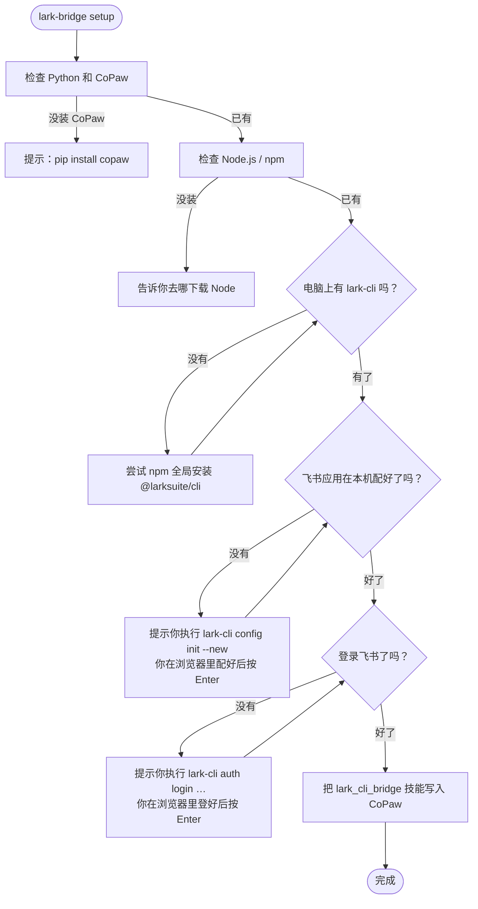
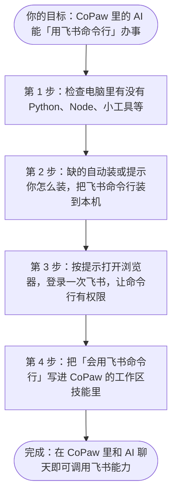
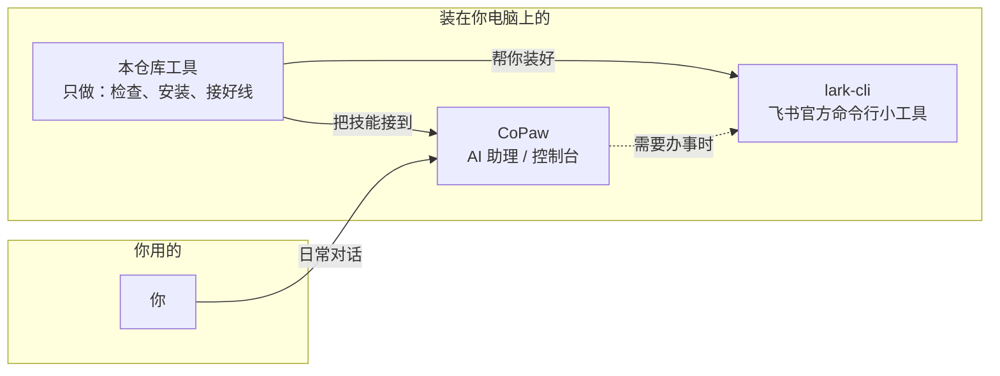
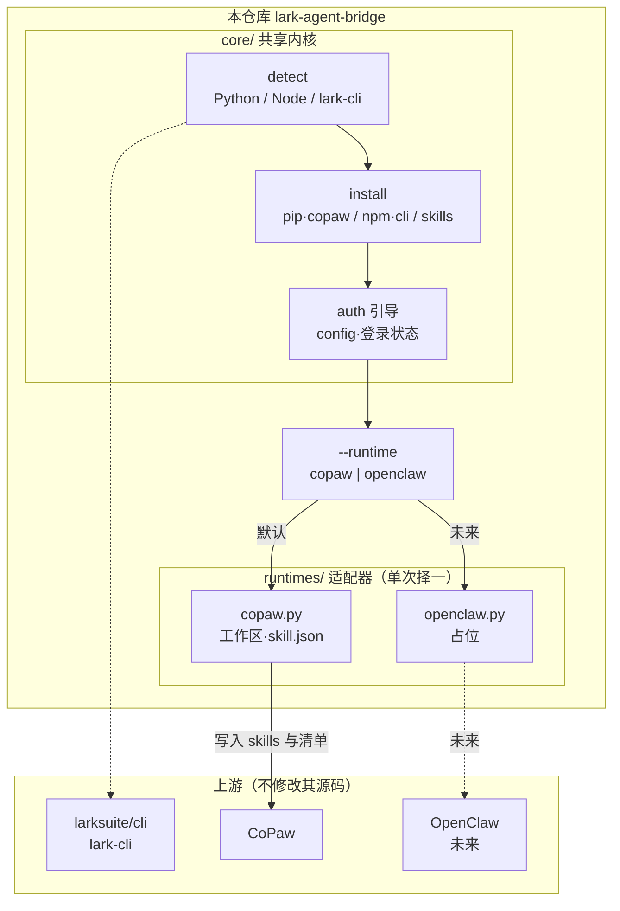
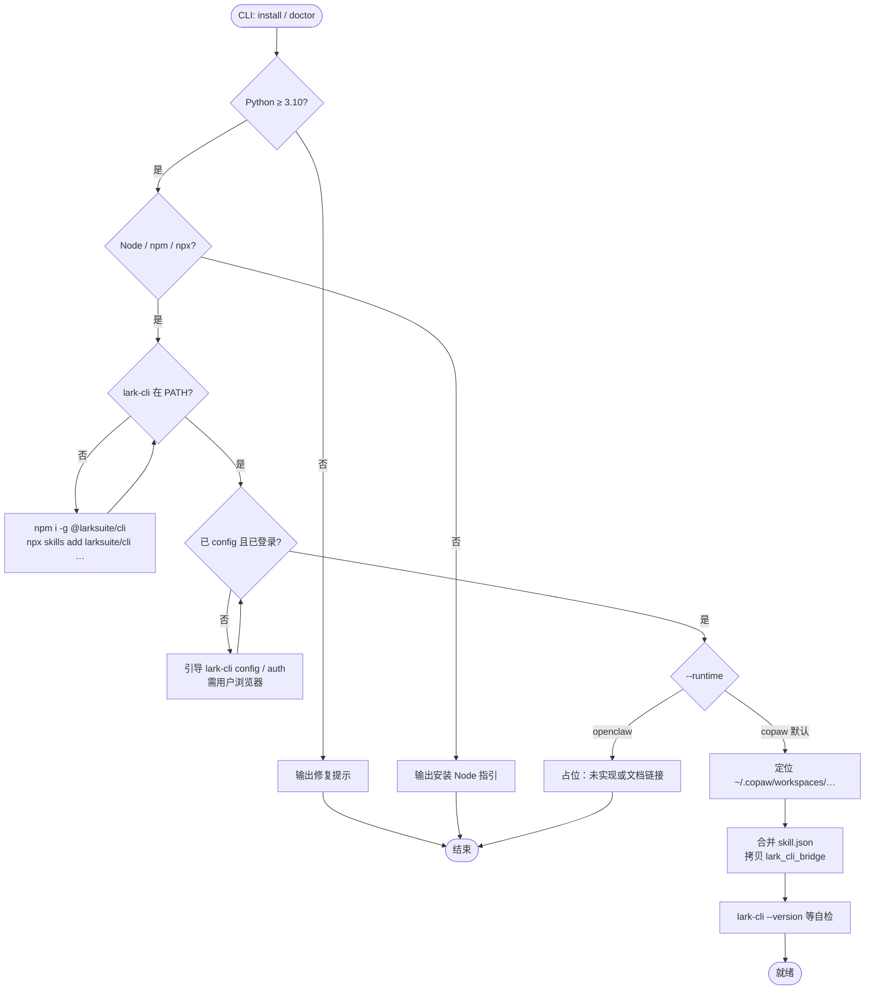
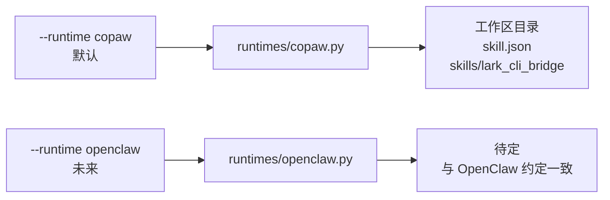

# Lark Agent Bridge

让你的 **CoPaw**（未来也支持 OpenClaw）学会用**飞书命令行**帮你办事 —— 不改任何开源项目代码。

**Windows · Linux · macOS** 通用 | 当前优先支持 **CoPaw**

### 交付范围与测试说明

| 目标 | 说明 |
|------|------|
| **安装** | 支持 `pip install git+https://github.com/guodaxia103/lark-agent-bridge.git@main` 与本仓库 `pip install -e .` |
| **CoPaw 技能** | `lark_cli_bridge` 含 `SKILL.md` + `references/`（发现命令、`api` 裸调、身份说明、官方 20 域索引），覆盖 **lark-cli 全能力路径**（快捷命令 → 注册 API → `lark-cli api`） |
| **自动化测试** | `pytest`：清单合并、路径、**模拟向 CoPaw 工作区写入技能**（验证 SKILL 与 `skill.json`，不启动 CoPaw 进程）；**集成**：若 PATH 上有 `lark-cli` 则跑 CLI 冒烟 |
| **人工验收** | 飞书 **config / OAuth** 须在浏览器完成；具体业务 API（如发消息、改表格）依赖租户权限，**无法在通用 CI 中全部调用**，请本地执行 `lark-bridge verify` 并在 CoPaw 对话中试真实任务 |

---

## 快速开始（已装过 CoPaw 的用户）

> 前提：你已经能正常使用 `copaw app`（说明 Python 和 pip 已就绪）。

**第一步：安装本工具**（任选一种）

**A. 从 PyPI 安装（发布后将可用）**

```bash
pip install lark-agent-bridge
```

**B. 从 GitHub 直接安装（无需先克隆，适合小白）**

```bash
pip install "git+https://github.com/guodaxia103/lark-agent-bridge.git@main"
```

> 若仓库地址不同，把上面 URL 换成你的 fork 地址。

**C. 克隆源码后本地安装（开发者）**

```bash
git clone https://github.com/guodaxia103/lark-agent-bridge.git
cd lark-agent-bridge
pip install -e ".[dev]"
```

安装完成后，终端里应能运行 `lark-bridge --version`。

**第二步：一键配置**

```bash
lark-bridge setup
```

与上面等价：`lark-bridge install`（同一命令的别名）。

就这两步。`setup` 会检查 Python / CoPaw / Node，按需安装全局 `lark-cli`（并尝试 `npx skills add larksuite/cli`），再把 `lark_cli_bridge` 写入 CoPaw 工作区。**飞书应用配置与用户登录**需你在本机执行 `lark-cli config init --new`、`lark-cli auth login ...`（在浏览器完成）；`setup` 会检测状态并在交互模式下提示你执行上述命令后按 Enter，**不会由本工具替你打印可点击的飞书 OAuth 链接**（链接由 `lark-cli` 在运行时输出）。

下面为**示意**：实际行首为 `[✓]` / `[!]` / `[×]` 等，且随环境变化。

```text
  [✓] Python 3.12.1
  [✓] CoPaw 包已安装 (1.0.2b1)
  [✓] Node.js v20.11.0
  [✓] npm 10.2.4
  [✓] lark-cli: C:\...\npm\lark-cli.CMD
  …（若未配置应用）…
  [!] 未检测到有效的 lark-cli 应用配置
      请在终端执行（将打开浏览器完成配置）：
        lark-cli config init --new
      完成后按 Enter 继续…
  …（若未登录或 token 无效）…
  [!] lark-cli 登录状态可能无效或已过期
      请在终端执行：
        lark-cli auth login --recommend
      完成后按 Enter 继续…
  部署到工作区: ...\workspaces\default
  [✓] 已写入 ...\skills\lark_cli_bridge 与 skill.json

  完成。请在 CoPaw 控制台新开对话，并在技能中启用 lark_cli_bridge（若未启用）。
```

环境已就绪、只想**更新技能文件**时可用：`lark-bridge setup --skip-lark-check --force -y`（含义见下文「setup — 安装流程详解」）。

**第三步（可选）：确认状态**

```bash
lark-bridge status
```

更多命令（`update`、`fix`、`uninstall` 等）见下文 **「所有命令（小白版）」** 一节（可搜索这几个字跳转）。

以下为**结构示意**；实际为若干行键值输出，并含 `技能目录存在:`、`skill.json` 中 `enabled` / `channels` 等。

```text
Python: 3.12.1  ✓
CoPaw:  1.0.2b1  ✓
Node:   v20.11.0  ✓
npm:    10.2.4  ✓
lark-cli: C:\...\lark-cli.CMD (1.0.x) ✓
飞书应用配置: 已配置
登录状态: 正常
技能 lark_cli_bridge: enabled=True channels=[...]
技能目录存在: True (...\workspaces\default\skills\lark_cli_bridge)
```

---

## 所有命令（小白版）

先记三件事：**这条命令是干什么的 → 我什么时候用 → 复制下面哪一行**。  
不确定有哪些子命令时，随时在终端运行：

```bash
lark-bridge --help
```

顶层还有：`lark-bridge --version`。

### 两套命令别混了

| 你在终端里敲的 | 是谁 | 干什么 |
|----------------|------|--------|
| **`lark-bridge …`** | 本仓库提供的工具 | 检查环境、把 **`lark_cli_bridge` 技能**写入 CoPaw、卸载技能等 |
| **`lark-cli …`** | 飞书官方命令行（`setup` 会帮你装） | 调飞书 API、**登录/退出登录/查权限**等 |

下面分别给出 **子命令全量表**（与 `lark-bridge --help` / `lark-cli auth --help` 一致）；**清除授权、重新授权**在第二张表（`lark-cli auth`），不在 `lark-bridge` 里。

---

### `lark-bridge` 子命令全量（仅下列，无 `deploy` 等别名）

| 命令 | 一句话 | 典型场景 |
|------|--------|----------|
| **`lark-bridge setup`** | 一键检查环境 → 按需装 `lark-cli` → 部署技能到 CoPaw | 第一次用、重装 |
| **`lark-bridge install`** | 与 **`setup` 完全相同**（别名，二选一） | 同上 |
| **`lark-bridge status`** | 打印 Python / CoPaw / Node / lark-cli / 飞书配置 / 技能是否在 | 自检、排错前先看 |
| **`lark-bridge update`** | 用当前 bridge 自带的技能模板覆盖工作区技能，保留 `skill.json` 里已有 `config` | pip 升级本工具后同步技能 |
| **`lark-bridge fix`** | 技能目录缺失则补全，否则合并 `skill.json`；登录异常时仅**提示**你执行 `lark-cli auth login` | 技能丢失、清单异常 |
| **`lark-bridge verify`** | 对 `lark-cli` 跑冒烟（version、help、config、auth、doctor） | 验证 CLI 是否装坏 |
| **`lark-bridge doctor`** | 输出更详细的环境与诊断信息 | 需要把日志发给别人时 |
| **`lark-bridge uninstall`** | 移除 CoPaw 技能与清单项；可选卸载全局 `@larksuite/cli` | 不用技能了、想从零再来 |

---

### `lark-cli auth` 子命令全量（清除授权、重新授权在这里）

> 以下均在装好 **`lark-cli`** 后使用；**不是** `lark-bridge` 的子命令。完整列表以 `lark-cli auth --help` 为准。

| 命令 | 一句话 | 典型场景 |
|------|--------|----------|
| **`lark-cli auth login`** | 浏览器里完成设备流授权，把用户 token 存本机 | **第一次登录**、**过期后重登**、**补权限**（`--scope` / `--recommend` / `--domain`） |
| **`lark-cli auth logout`** | **清除本机**保存的用户 token 与已登录用户列表 | **换账号前**、想**彻底退出 CLI 用户登录** |
| **`lark-cli auth status`** | 看当前 token 是否存在、是否过期（可加 `--verify` 联网验） | 怀疑登录失效 |
| **`lark-cli auth list`** | 列出本机记录的已登录用户 | 多用户时查看 |
| **`lark-cli auth scopes`** | 查询**开放平台里**该应用已开通的用户权限 | 对照后台是否开通某 scope |
| **`lark-cli auth check`** | 检查当前 token 是否包含指定 scope（**必须**带 `--scope "a b"`） | 调用 API 前确认权限 |

**和「飞书 App 里撤销授权」的区别**：`auth logout` 只清**本机文件**里的凭证；若要在飞书账号侧撤销对第三方应用的授权，需在飞书客户端 / 账号安全 / 授权管理或开放平台操作。

**在 CoPaw / Agent 里跑 `auth login` 看不到链接时**：对 **`auth login` 子命令**追加 **`--json`**，授权链接会走 stdout（见技能包内 `references/auth_and_identity.md`）。

---

### 速查表（与上表一致，用人话）

| 命令 | 用人话说 | 我什么时候用它？ |
|------|----------|------------------|
| **`lark-bridge setup`** | **一条龙**：检查电脑 → 按需装 Node / 飞书命令行 → 把「会用飞书 CLI」写进 CoPaw | **第一次用**、换电脑、环境乱了想重来一遍 |
| **`lark-bridge install`** | 和 **`setup` 完全一样**，只是换个名字 | 和 `setup` **二选一**，敲哪个都行 |
| **`lark-bridge status`** | **体检单**：Python、CoPaw、Node、lark-cli、飞书配置、技能在不在 | **装完想确认**、出问题时先看一眼 |
| **`lark-bridge update`** | **只更新技能文件**（`lark_cli_bridge` 文件夹），不动你别的设置 | **刚用 pip 升级了本工具**，想拿最新版技能说明 |
| **`lark-bridge fix`** | **补技能 / 修清单**：技能夹没了就补，有了就合并 `skill.json` | **控制台里找不到技能**、怀疑技能损坏 |
| **`lark-bridge verify`** | **只测飞书命令行**：装没装好、能不能跑 | **装完 lark-cli 后**自检（不要求已登录飞书） |
| **`lark-bridge doctor`** | **比 status 更啰嗦**：路径、版本、原始信息都打出来 | **别人帮你排查**时，把输出存成文件发过去 |
| **`lark-bridge uninstall`** | **卸掉** CoPaw 里的飞书技能；可选把本机全局 `lark-cli` 也卸掉 | **不想用这个技能了**、想干净重装 |

---

### 1）`setup` / `install` — 第一次装、或整环境重来

**干什么：** 检查 Python、CoPaw、Node；没有就提示或帮你装；再装全局 `lark-cli`；最后把 `lark_cli_bridge` 技能拷进 CoPaw 工作区。  
**什么时候用：** 新手第一次走流程；或你删过技能想再装。

**直接复制（最常用）：**

```bash
lark-bridge setup
```

**更多例子（按需复制）：**

```bash
# 你有多个 CoPaw 工作区，只给其中一个装
lark-bridge setup --workspace 你的工作区名字

# 给所有工作区都装一份技能
lark-bridge setup --all-workspaces

# 国内网下 npm 慢，让安装时用国内镜像
lark-bridge setup --cn

# 你已经自己装好了 lark-cli、也配过飞书，只想更新/覆盖技能文件，少点提问
lark-bridge setup --skip-lark-check --force -y
```

**参数是什么意思（看不懂就跳过，只记最上面一行也行）：**

| 参数 | 人话 |
|------|------|
| `--workspace <名字>` | 只处理这个名字下面的 CoPaw 工作区 |
| `--all-workspaces` | 所有工作区都来一遍 |
| `--cn` | 装 lark-cli 前，先把 npm 镜像切到国内 |
| `--force` | 技能文件夹已存在也**覆盖**成最新模板 |
| `--skip-lark-check` | **不检查** Node / lark-cli / 登录，**只部署技能** |
| `-y` / `--yes` | 尽量少问「是否安装」，适合脚本或老手 |

**它内部大致做什么（放心用就行）：**



某一步失败会说明原因；你修好后**再跑一次** `lark-bridge setup` 即可。

---

### 2）`status` — 看一眼现在正不正常

**干什么：** 打印当前环境、飞书配置是否检测到、技能目录在不在、`skill.json` 里有没有登记。  
**什么时候用：** 装完想确认；或报错前先扫一眼。

```bash
lark-bridge status
```

想看本机有哪些 CoPaw 工作区：

```bash
lark-bridge status --all-workspaces
```

---

### 3）`update` — 只更新技能，不重装整套环境

**干什么：** 用**当前安装的 lark-agent-bridge 里自带的**最新 `SKILL.md` 等覆盖工作区里的技能；合并 `skill.json` 时会**尽量保留**你原来给技能配的 `config`。  
**什么时候用：** 你用 `pip install -U …` 升级了 **lark-agent-bridge** 之后，想让 CoPaw 里的说明文档也跟上。

```bash
lark-bridge update
```

指定工作区或全部：

```bash
lark-bridge update --workspace 你的工作区名字
lark-bridge update --all-workspaces
```

---

### 4）`fix` — 技能丢了就补，清单不对就合并

**干什么：**  
- 若 **`lark_cli_bridge` 文件夹或里面的 `SKILL.md` 没了**，会**重新部署**一份；  
- 若技能还在，就**合并 `skill.json`**（不瞎删别的技能）。  
若发现飞书登录可能过期，会在最后**打印一行字**，让你自己去执行 `lark-cli auth login`，**不会自动弹出浏览器**。

**什么时候用：** CoPaw 里看不到飞书技能、或你动过文件怕坏了。

```bash
lark-bridge fix
```

可选（和 `setup` 一样）：

```bash
lark-bridge fix --workspace 你的工作区名字
lark-bridge fix --all-workspaces
lark-bridge fix -y
```

---

### 5）`verify` — 检查「飞书命令行」装没装坏

**干什么：** 依次跑 `lark-cli --version`、`--help`、`config show`、`auth status`、`doctor`，看 CLI 是否可用。  
**什么时候用：** 刚装完 `lark-cli`；怀疑 PATH 或安装坏了。**还没配置飞书**时，中间几步可能黄字失败，属正常。

```bash
lark-bridge verify
```

---

### 6）`doctor` — 详细日志，方便别人帮你看

**干什么：** 把版本、路径、检测结果等**多打一些字**（纯文本，没有漂亮表格框）。  
**什么时候用：** `status` 不够；需要把信息发给别人。

```bash
lark-bridge doctor
```

保存成文件：

```bash
lark-bridge doctor > report.txt
```

---

### 7）`uninstall` — 卸技能，可选卸飞书命令行

**干什么：**  
- 默认：删掉 CoPaw 工作区里的 **`lark_cli_bridge` 文件夹**，并在 `skill.json` 里去掉对应条目；  
- 可选：再问你要不要 **`npm uninstall -g @larksuite/cli`**（卸掉本机全局 lark-cli）。

**什么时候用：** 不用这个技能了；想从零再跑一遍 `setup`。

**只卸技能、保留 lark-cli（常见）：**

```bash
lark-bridge uninstall --skill-only
```

**连技能带全局 lark-cli 一起卸（会多问一句；加 `-y` 全自动）：**

```bash
lark-bridge uninstall -y
```

**注意：** 不会删你电脑上的 `~/.lark-cli` 配置文件夹；也不会卸 **pip 里的 lark-agent-bridge**，要卸请自己：`pip uninstall lark-agent-bridge`。

---

## 常见问题与解决

> 与**技能文件 / skill.json** 相关可先试 **`lark-bridge fix`**；与 **Node、网络、飞书账号** 相关请看下面各条。

### Q: 运行 setup 提示「Node.js 未找到」

Node.js 是 lark-cli 的运行依赖，需要先安装：

| 系统 | 推荐安装方式 |
|------|-------------|
| **Windows** | `winget install OpenJS.NodeJS.LTS` 或去 https://nodejs.org 下载 |
| **macOS** | `brew install node` 或去 https://nodejs.org 下载 |
| **Linux (Ubuntu/Debian)** | `sudo apt install nodejs npm` |

安装后**重新打开终端**，再跑 `lark-bridge setup`。

### Q: npm install 报权限错误

不要用 `sudo npm install -g`。改用用户级安装：

```bash
npm config set prefix ~/.npm-global
export PATH=~/.npm-global/bin:$PATH   # 加到 ~/.bashrc 或 ~/.zshrc
lark-bridge setup                      # 重新运行
```

Windows 一般不会遇到此问题。

### Q: 飞书登录过期了，CoPaw 里调飞书报错

在本机终端执行（或按 `fix` 末尾提示）：

```bash
lark-cli auth login --recommend
```

`lark-bridge fix` **不会**自动打开浏览器；若 token 异常，只会提示你执行上述命令。

### Q: 想「清除授权」或换账号重新登录（本机 lark-cli）

下面这些命令都是 **`lark-cli auth ...`**，在终端执行；**不是** `lark-bridge` 的子命令（`lark-bridge` 只管 CoPaw 技能与环境）。

| 你想做什么 | 复制这条 |
|------------|----------|
| **清掉本机已保存的登录**（用户 token 清掉，相当于退出登录，下次要重新 `auth login`） | `lark-cli auth logout` |
| **重新授权**（补权限、过期后重登、换账号前可先 `logout` 再登） | `lark-cli auth login --recommend` 或 `lark-cli auth login --scope "缺的权限1 缺的权限2"` |
| **看一眼现在登没登、token 状态** | `lark-cli auth status`（可加 `--verify` 联网验） |
| **查当前应用已开通哪些用户权限**（后台配置） | `lark-cli auth scopes` |
| **查本机已登录用户列表** | `lark-cli auth list` |
| **检查当前 token 是否包含某权限** | `lark-cli auth check --scope "wiki:wiki:readonly"`（`--scope` 必填，多个用空格） |

**说明（避免误会）：**

- **`auth logout` 只清本机凭证**（你电脑里存的 token / 登录用户列表），**不会**代替你在飞书 App 里「撤销对第三方应用的授权」。若要在飞书侧彻底关掉某应用访问，需要在 **飞书客户端 / 账号安全 / 授权管理** 或 **开放平台** 里按官方入口操作。
- **重新登录**与 **第一次登录**用的是 **`auth login`**；多次登录可**增量**要权限（scope 会累积，以实际 CLI 行为为准）。
- 不确定有哪些子命令时：`lark-cli auth --help`。

### Q: 在 CoPaw / Agent 里执行 `auth login`，界面里看不到授权链接

`lark-cli` 默认把链接打在 **stderr**，部分环境只显示 **stdout**。在 **仅针对 `auth login` 子命令** 时追加 **`--json`**，授权信息会在 stdout 以 JSON 输出（`verification_uri_complete` 等）。其它命令仍按惯例使用 `--format json`，不要混用。详见随技能下发的 `references/auth_and_identity.md`。

### Q: CoPaw 控制台里看不到飞书技能

1. 先确认：`lark-bridge status` 是否显示技能「已启用」
2. 如果已启用：在 CoPaw 控制台**新开一个对话**（不是在旧对话里）
3. 如果未启用：`lark-bridge fix` 会尝试修复
4. 还是不行：`lark-bridge setup --force` 强制重新部署

### Q: 网络慢 / 装不上 npm 包

```bash
# 切换到国内镜像
lark-bridge setup --cn

# 或手动设置
npm config set registry https://registry.npmmirror.com
lark-bridge setup
```

### Q: 我有多个 CoPaw Agent，想给某一个装

```bash
# 查看所有工作区
lark-bridge status --all-workspaces

# 给指定工作区装
lark-bridge setup --workspace my_agent_name

# 全部装
lark-bridge setup --all-workspaces
```

### Q: 想彻底重来

```bash
lark-bridge uninstall        # 移除 CoPaw 技能；可选卸全局 @larksuite/cli
pip uninstall lark-agent-bridge   # 若也要卸本 Python 工具
pip install "git+https://github.com/guodaxia103/lark-agent-bridge.git@main"   # 或你的 fork
lark-bridge setup
```

`uninstall` **不会**删除 `~/.lark-cli` 里的应用配置与 token；若要完全清配置，可手动删除该目录（慎用）。

### Q: fix 也修不好，怎么办？

```bash
lark-bridge doctor > report.txt
```

把 `report.txt` 的内容发到 GitHub Issues 或社区群里，别人看到完整诊断信息就能帮你。

---

## 这是什么？（项目定位）

| 项目 | 说明 |
|------|------|
| 仓库名 **`lark-agent-bridge`** | **Lark CLI ↔ 多种 Agent 运行时** 的桥接工具 |
| 与上游关系 | **不修改** CoPaw / OpenClaw / lark-cli 的任何代码 |
| 优先级 | 当前版本以 **CoPaw** 为主；OpenClaw 待上游稳定后适配 |

若 OpenClaw 最终仓库名或包名与文档不一致，仅在 **`runtimes/openclaw`** 与 README「支持矩阵」中更新，**不改仓库总名**。

---

> **以下为开发者 / 贡献者文档。** 只是使用的话，看上面就够了。

---

## 1. 设计原则

| 原则 | 说明 |
|------|------|
| 上游零侵入 | 仅通过命令行、用户目录下的配置与技能文件集成 |
| 运行时插件化 | **共享内核**（检测 lark-cli、安装 npm 包、OAuth 引导）；**按 runtime 分支**（工作区路径、`skill.json` 格式、Skill 模板路径） |
| 可重复执行 | 幂等：已满足则跳过或明确提示 |
| 可诊断 | 每步成功/失败与修复建议 |
| 安全默认 | Skill 内对 `lark-cli` **子命令白名单**；密钥不落本仓库 |
| 跨平台 | 路径、进程、编码在 Win/Linux 显式处理（见第 6 节） |

---

## 2. 运行时支持矩阵（规划）

| 运行时 | 状态 | 说明 |
|--------|------|------|
| **CoPaw** | **当前优先** | 默认工作区 `~/.copaw/workspaces/...`，`COPAW_WORKING_DIR`，`skill.json` 与官方 Skills 格式对齐 |
| **OpenClaw** | **规划中** | 待上游 API/目录约定明确后实现；接口预留见第 3 节 |

CLI 入口建议：`--runtime copaw`（默认） / 未来 `--runtime openclaw`。

---

## 3. 架构与流程图

### 先看这个：小白版（你在做什么？）

下面这张**不讲命令、不讲文件名**，只讲「你要干嘛」和「先后关系」。看懂它，再看后面的技术版流程图会轻松很多。

**一句话**：你想让 **CoPaw 里的 AI** 也能像人一样，用**飞书官方命令行**去查资料、发消息等；本仓库就是帮你把电脑环境装好，并把这条能力**接到 CoPaw 里**（不动飞书和 CoPaw 的源代码）。



**和「在飞书里直接跟机器人聊天」不一样**：飞书里的机器人是**一条线**；这里是 **CoPaw 里的 AI** 通过本机命令行去调飞书，两条路可以同时存在，一般**不会互相顶替**。

---

**三件东西谁管啥**（混在一起的时候最容易晕，对照一下）：



| 名字 | 用人话说是啥 |
|------|----------------|
| **CoPaw** | 跑在你电脑上的 AI 助理，你在网页或频道里跟它说话。 |
| **lark-cli** | 飞书官方出的**命令行**，让程序能代替你操作飞书（要你先登录授权）。 |
| **本仓库（Lark Agent Bridge）** | **不开发飞书、也不改 CoPaw**，只负责：检查环境、安装衔接、把「会用 lark-cli」写进 CoPaw 的技能里。 |

---

### 3.1 分层架构（共享内核 → 运行时适配器 → 上游）



**读图要点**：检测与安装走 **同一套内核**；只有「数据根目录、工作区路径、manifest 字段」随 **runtime** 变化；`lark-cli` 二进制与 CoPaw 进程相互独立。

---

### 3.2 用户执行 `install`（或等价）时的主流程



**`doctor`**：只读上述判断分支，不执行安装、不写工作区。  
**`skill-only`**：从 `RUNTIME → copaw` 进入，跳过 `NPM` / `BROWSER`（假定环境已就绪）。

---

### 3.3 运行时选择（CLI 参数 → 适配器）



---

### 3.4 纯文本版（无 Mermaid 渲染时）

```text
  [用户] → lark-agent-bridge CLI
              │
              ├─ core: detect → install → auth 引导
              │        └─ 调用本机: pip / npm / lark-cli（不修改上游）
              │
              └─ runtime 分支
                     ├─ copaw  → ~/.copaw/workspaces/… + skill.json + Skill
                     ├─ openclaw → （占位）
                     └─ future → …

  lark-cli ←──── 共享内核安装与检测 ────→ 飞书开放平台 API
  CoPaw    ←──── 仅通过工作区文件集成 ───→ 与内置飞书通道并行
```

---

- **内核**：Python 3.10+，Node/npm/`lark-cli`/Skills 检测与安装、自检脚本。
- **适配器**：每个 runtime 一个模块，实现「解析数据根目录、枚举工作区、合并清单、拷贝 `skills/lark_cli_bridge`」；**OpenClaw** 初期可为 `NotImplemented` + 文档链接。

---

## 4. 功能规划（分阶段）

### Phase A — MVP（仅 CoPaw）

- **环境探测**
  - Python ≥ 3.10、`copaw`（`pip show` 获取版本）
  - Node / npm / npx
  - `lark-cli`（`shutil.which` 或 `npx` 解析）
  - 网络可达性（npm registry、飞书开放平台域名）
- **依赖安装（用户确认后）**
  - `pip install -U copaw`（或文档化用户自建 venv）
  - `npm install -g @larksuite/cli`（优先用户级 prefix）
  - `npx skills add larksuite/cli -y -g`（lark-cli 官方 Agent Skill）
- **lark-cli 配置与登录**
  - `lark-cli config show` → 解析 stdout JSON（注意：未配置时退出码仍为 0，需判断 stdout 是否有效 JSON）
  - `lark-cli auth status` → 解析 `tokenStatus`/`identity` 字段
  - 未配置 → 引导 `config init --new`（**打印浏览器 URL，明确提示用户操作**）
  - 未登录 → 引导 `auth login --recommend`（同上）
- **CoPaw 工作区**
  - 默认 `~/.copaw/workspaces/default`；`COPAW_WORKING_DIR` 覆盖
  - 多工作区：`--workspace <name>` 或 `--all-workspaces`
  - 检测 CoPaw 版本与 `skill.json` 的 `schema_version` 是否兼容
- **Skill 下发**
  - 拷贝 `skills/lark_cli_bridge/`（含 `SKILL.md`、`references/`）到目标工作区
  - **SKILL.md frontmatter `name` 必须与目录名 `lark_cli_bridge` 一致**
  - **安全合并** `skill.json`：校验 `schema_version`，只追加/更新本条目，`version` 计数 +1
  - `channels` 默认 `["all"]`
  - **预扫描**：本地用 CoPaw 的 skill_scanner 规则验证不触发高危
- **自检与提示**
  - `lark-cli --version`
  - 提示用户：在 CoPaw 控制台刷新或新开对话以加载新技能

### Phase B — 体验与运维

- 子命令：`doctor`（只读）、`install`（完整链路）、`skill-only`（仅同步 Skill）、`update`（更新 SKILL.md 保留用户 config/channels）、`uninstall-skill`（清理）
- 日志、`--verbose`、`--log-file`
- 建议版本范围与 CI smoke test
- 中国用户镜像/代理提示

### Phase C — OpenClaw 与进阶

- 实现 `runtime=openclaw`（目录、清单格式以届时官方为准）
- CI（Windows + Linux + macOS）
- i18n、离线说明

---

## 5. Skill 设计（核心，必须理解）

### 5.1 CoPaw Skill 的真实运行机制

> **最常见的误解：以为 Skill 是一段 Python 脚本，CoPaw 会直接执行它。**

实际上：

1. CoPaw 启动时，把 `SKILL.md` 的内容**注入到 AI 的系统提示词**里。
2. AI 在对话中看到这些说明后，**自己决定**何时调用已有的工具（如 `execute_shell_command`、`read_file`）来执行操作。
3. `scripts/` 和 `references/` 目录只是**辅助资料**，供 AI 通过 `read_file` 工具读取，不会被 CoPaw 直接运行。

**对我们的影响**：`lark_cli_bridge` 这个 Skill 的核心产物是一份**写给 AI 看的操作手册**（`SKILL.md`），教它"怎么调 `lark-cli`、怎么解析输出、出错了怎么办"。

### 5.2 Skill Scanner 安全扫描（必须规避）

CoPaw 在**创建、导入、启用** Skill 时会自动扫描内容（默认 `block` 模式）：

- 扫描引擎：`PatternAnalyzer`，加载 `rules/signatures/*.yaml` 正则规则
- **会被拦截的模式**（CRITICAL/HIGH）：`os.system(`、`subprocess.*shell=True`、`eval(`、`exec(`、`curl|bash` 等
- 文件限制：单个 Skill 最多约 **100 个文件**，单文件 **5 MB**
- 命中高危规则 → `is_safe == False` → **Skill 无法启用**

**设计决策**：我们的 Skill **不在 `scripts/` 中写 Python 子进程调用代码**。`SKILL.md` 只用自然语言指导 AI 使用 `execute_shell_command` 工具去调 `lark-cli`。辅助脚本（如有）应只做数据格式转换，不含 `subprocess` / `os.system` 等模式。

### 5.3 Tool Guard 对 `execute_shell_command` 的约束

当 AI 真正调用 `execute_shell_command` 时，CoPaw 的 **Tool Guard** 会实时检查命令字符串：

- 拦截规则在 `dangerous_shell_commands.yaml`：`rm`、`del`、`sudo`、反向 shell、服务控制等
- **`lark-cli` 本身不在危险列表中**，正常调用不会被拦
- 但若命令拼接了危险模式（如 `lark-cli ... && rm -rf /`），仍会被拦截

**SKILL.md 应当**：指导 AI 只使用白名单内的 `lark-cli` 子命令，不拼接任意用户输入。

### 5.4 SKILL.md 内容规划

| 板块 | 内容 |
|------|------|
| **前言** | 说明本 Skill 让 AI 能通过本机 `lark-cli` 操作飞书；与内置飞书通道的区别 |
| **可用命令白名单** | 按领域列出安全子命令：`calendar +agenda`、`im +send`、`contact +search-user`、`docs +search` 等 |
| **输出解析** | `lark-cli` 默认 `--format json`；教 AI 解析 JSON 响应、识别 `_notice` 字段 |
| **错误处理** | 退出码含义（0 成功 / 1 API 错误 / 2 参数错误 / 3 认证失败 / 4 网络 / 5 内部）；stderr JSON envelope |
| **权限不足** | 引导用户执行 `lark-cli auth login --recommend` 补充授权 |
| **安全约束** | 禁止拼接用户原文到命令中（防注入）；禁止调用 `config`/`auth` 修改类子命令 |

### 5.5 `skill.json` 清单条目设计

CoPaw 工作区清单（`<workspace>/skill.json`）的完整字段：

```json
{
  "schema_version": "workspace-skill-manifest.v1",
  "version": 1,
  "skills": {
    "lark_cli_bridge": {
      "enabled": true,
      "channels": ["all"],
      "source": "customized",
      "config": {},
      "metadata": {
        "name": "lark_cli_bridge",
        "description": "通过本机 lark-cli 操作飞书",
        "version_text": "0.1.0"
      },
      "updated_at": "2026-04-06T00:00:00Z"
    }
  }
}
```

**关键约束**：
- `metadata.name` **必须与目录名一致**（AgentScope 用 frontmatter `name` 注册，CoPaw 用目录名解析；不一致会导致找不到技能）
- `channels` 设为 `["all"]` 使所有通道可用；或精确指定如 `["console", "feishu", "dingtalk"]`
- **合并策略**：只追加/更新 `lark_cli_bridge` 条目，`version` 计数 +1，不覆盖其它技能
- `schema_version` 必须填且与 CoPaw 当前版本一致（`workspace-skill-manifest.v1`）

### 5.6 CoPaw Skill Config 机制（可选利用）

CoPaw 提供 per-skill 的 `config` 字段与 `COPAW_SKILL_CONFIG_*` 环境变量注入。可用于：
- 指定 `lark-cli` 配置目录（若非默认 `~/.lark-cli`）
- 传递自定义白名单列表路径
- 控制 SKILL.md 内的行为开关

---

## 6. CoPaw 衔接（事实依据）

- 数据根：`COPAW_WORKING_DIR` 默认 `~/.copaw`。
- 默认工作区：`<根>/workspaces/default`。
- 技能以工作区为单位解析；`skill.json` 字段需与当前 CoPaw 版本对齐（发版时注明 tested 版本）。
- **已验证版本**：CoPaw `1.0.2b1`、AgentScope `1.0.18`。
- **注入后生效方式**：CoPaw 在每次对话 / agent 启动时重新解析 `skill.json` 与 skills 目录；通常**无需重启服务**（但建议脚本在注入后提示用户在控制台刷新或重新开始对话以确保加载）。
- **多 agent 工作区**：CoPaw 支持多个 agent（各有独立 `workspaces/<id>`）。默认行为注入 `default`；`--workspace` 参数可选指定或 `--all-workspaces` 批量注入。

---

## 7. lark-cli 状态检测（技术细节）

脚本中 `core/detect.py` 需要处理以下 lark-cli 特殊行为：

### 7.1 配置检测

- **命令**：`lark-cli config show`
- **已配置**：stdout 输出 JSON（含 `appId`、`appSecret` 掩码等）
- **未配置**：stderr 打印 `Not configured yet`，stdout **可能无 JSON**，但**退出码仍为 0**
- **检测策略**：尝试解析 stdout JSON；失败则判定为未配置。或直接检查 `~/.lark-cli/config.json` 文件是否存在。

### 7.2 登录检测

- **命令**：`lark-cli auth status`（始终输出 JSON，不弹交互）
- 需解析字段：`tokenStatus`（如 `valid` / `expired` / `not_found`）、`identity`、`expiresAt`
- **可选**：`lark-cli auth status --verify` 联网校验 token 可用性
- **权限检查**：`lark-cli auth check --scope "calendar:read"` — 成功返回 `ok: true`，失败退出码 1

### 7.3 lark-cli 结构化退出码

| 退出码 | 含义 | 脚本应对 |
|--------|------|----------|
| 0 | 成功 | 继续 |
| 1 | API / 通用错误 | 解析 stderr JSON envelope |
| 2 | 参数校验失败 | 提示命令格式 |
| 3 | 认证失败 | 引导重新 `auth login` |
| 4 | 网络错误 | 提示检查网络/代理 |
| 5 | 内部错误 | 建议升级 lark-cli |

### 7.4 凭证存储（平台差异）

| 平台 | 存储方式 | doctor 验证要点 |
|------|----------|-----------------|
| **Windows** | DPAPI + 注册表 | 确认当前用户有注册表读写权限 |
| **Linux** | AES-256-GCM 加密文件 | 确认 `~/.lark-cli/` 目录存在且可读写 |
| **macOS** | 系统 Keychain | 确认 Keychain 访问不被 MDM 阻止 |

---

## 8. Windows / Linux / macOS 适配

- **单一代码路径**：Python 标准库 + `subprocess`（`shell=False`）、`pathlib`、`shutil.which`。
- **编码**：UTF-8；Windows 可选 cp936 兜底。
- **入口**：`python -m lark_agent_bridge` 为主；可选薄封装 `.ps1` / `.sh`。
- **CI**：`windows-latest` + `ubuntu-latest` + `macos-latest`。

路径对照：

| 项目 | Windows | Linux / macOS |
|------|---------|---------------|
| CoPaw 根（默认） | `%USERPROFILE%\.copaw` | `$HOME/.copaw` |
| lark-cli 配置 | `%USERPROFILE%\.lark-cli` | `$HOME/.lark-cli` |
| npm 全局 | `%APPDATA%\npm` | 依赖 nvm/fnm 或 `/usr/local` |
| OpenClaw 根 | **待定** | 同左 |

### 8.1 网络与代理（中国用户）

- **npm**：`npm config set registry https://registry.npmmirror.com`（或文档提示）
- **pip**：`pip config set global.index-url https://mirrors.aliyun.com/pypi/simple/`
- **lark-cli OAuth**：需访问飞书开放平台域名（`open.feishu.cn` / `open.larksuite.com`），公司内网可能需代理
- **doctor** 应检测网络可达性并在失败时给出镜像/代理建议

---

## 9. 建议目录结构

```text
lark-agent-bridge/
  README.md
  pyproject.toml
  src/lark_agent_bridge/
    __init__.py
    __main__.py               # python -m lark_agent_bridge
    cli.py                    # click 子命令入口
    self_check.py             # lark-bridge verify 冒烟
    core/
      detect.py               # 环境探测（Python/Node/lark-cli/config/auth）
      install.py              # pip/npm、npx skills add
    runtimes/
      copaw.py                # CoPaw：工作区路径、skill.json 合并、技能目录拷贝
      openclaw.py             # 占位
    manifest/
      merge.py                # skill.json 安全合并（只追加/更新本技能条目）
    skills/
      lark_cli_bridge/
        SKILL.md
        references/           # auth、输出格式、领域索引等
  tests/
    test_manifest_merge.py
    test_paths.py
    test_deploy_pipeline.py
    integration/
      test_lark_cli_optional.py
```

---

## 10. 升级与维护

### 10.1 上游升级时

| 场景 | 影响 | 本仓库应对 |
|------|------|------------|
| CoPaw 大版本升级 | `skill.json` schema 可能变化 | 检测 `schema_version`，不匹配时提示并更新合并逻辑 |
| lark-cli 升级 | 子命令/输出格式可能变化 | SKILL.md 白名单重新验证；CI 跑 smoke test |
| AgentScope 升级 | `register_agent_skill` 行为可能变化 | 关注 frontmatter 解析与 prompt 注入格式 |

### 10.2 本仓库版本策略

- 在 README 和 `pyproject.toml` 中声明 **tested 版本矩阵**（如 `copaw >= 1.0.0, < 2.0`、`@larksuite/cli >= 1.0.0`）
- 每次上游发版后在 CI 中跑 `doctor` + manifest 合并测试

### 10.3 `update` 子命令（Phase B）

- 重新拷贝最新 `SKILL.md` 到工作区，保留用户 `config` 字段
- 不覆盖用户对 `channels` 的自定义

---

## 11. 风险与边界

- **OAuth 无法完全无人化**：`config init` / `auth login` 需用户在浏览器完成授权。脚本在该步骤前后**明确打印提示**，而非静默等待。
- **Skill Scanner 误报**：若 SKILL.md 内的示例命令文本被 CoPaw 的正则误判为危险模式，需调整措辞或向 CoPaw 社区反馈规则建议。
- **两套飞书应用**：通道机器人（bot 身份）vs lark-cli（用户身份）权限范围不同，需在文档中强调**不是替代关系**。
- **lark-cli 动态 meta**：服务命令列表依赖嵌入/远程 meta 数据，开发环境与发布版本可能不一致。
- **并发安全**：多个 agent 同时调 `lark-cli` 可能触发飞书 API 频控（租户级）；SKILL.md 应提示 AI 避免批量循环调用。

---

## 12. 许可证

工具代码建议 MIT；引用上游文档需注明来源。

---

## 13. 实现顺序（建议）

### Phase A — MVP

1. 骨架：`pyproject.toml`、`cli.py`（`doctor` / `install` / `skill-only`）、CI（3 平台）
2. `core/detect.py`：Python/Node/lark-cli 检测 + `config show`/`auth status` JSON 解析 + 网络可达性
3. `skills/lark_cli_bridge/SKILL.md`：编写 + **用 CoPaw skill_scanner 规则做本地预扫描测试**
4. `manifest/merge.py`：`skill.json` 安全合并（schema_version 校验、只追加、version +1）
5. `runtimes/copaw.py`：工作区路径解析 + Skill 拷贝 + 合并 + 注入后提示刷新
6. 端到端自检：`lark-cli --version` + 在 CoPaw 控制台验证 Skill 出现

### Phase B — 体验与运维

7. `update` 子命令（保留用户 config/channels，更新 SKILL.md）
8. `uninstall-skill`（清理目录与 manifest 条目）
9. 日志、`--verbose`、`--log-file`
10. 版本矩阵声明与 CI smoke test

### Phase C — OpenClaw 与进阶

11. `runtimes/openclaw.py` 实现（待上游约定）
12. i18n（中英文 CLI 提示）
13. 离线模式文档与镜像建议

---

## 上游链接

- [larksuite/cli](https://github.com/larksuite/cli)  
- [CoPaw](https://github.com/agentscope-ai/CoPaw)  
- OpenClaw：正式仓库与文档链接确定后补充至本 README「支持矩阵」  

---

## 维护者：首次推送到 GitHub

当前自动化 Token 可能无「创建仓库」权限时，在浏览器手动建库后推送即可。

1. 打开 [新建仓库](https://github.com/new)，名称填 **`lark-agent-bridge`**，**不要**勾选「使用 README 初始化」。
2. 在本项目根目录执行（已 `git init` 并提交时可跳过前两步）：

```bash
git init
git add .
git commit -m "chore: initial release v0.1.0 — lark-bridge CLI for CoPaw"
git branch -M main
git remote add origin https://github.com/guodaxia103/lark-agent-bridge.git
git push -u origin main
```

3. 推送成功后，用户即可使用上文 **「从 GitHub 直接安装」** 一条命令安装。

**发 PyPI（可选）**：配置 `PYPI_TOKEN` 后使用 `python -m build` + `twine upload`（需维护者账号）。
